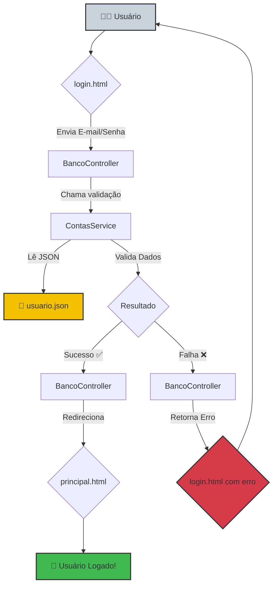

<div align="center">
  <h1>🚀 Análise e Descrição do Projeto: Banco de Talentos 🚀</h1>
</div>

<p align="center">
  
  
  
  
</p>

## 📜 Visão Geral

> Este projeto é uma aplicação web Spring Boot chamada **"Banco de Talentos"**. O objetivo principal é criar um sistema de autenticação de usuários (login/logout) que controla o acesso a uma página principal. A aplicação segue o padrão **MVC (Model-View-Controller)**, separando a lógica de negócio, a manipulação de dados e a interface do usuário.

* **Backend:** Java com Spring Boot
* **Frontend:** HTML com Thymeleaf (para renderização dinâmica)
* **Dados:** As informações dos usuários são lidas de um arquivo `usuario.json`, o que simplifica o projeto por não necessitar de um banco de dados neste momento.

---

## 📂 Estrutura de Arquivos

A organização dos principais diretórios do projeto é a seguinte:

```plaintext
# ☕️ Caminho para os arquivos Java (Controllers, Services, Models)
C:\Codigo\projetodepesquisa\demo\src\main\java\com\bancodetalentos\demo\

# 🎨 Caminho para os arquivos de Frontend (HTML, CSS, Imagens)
C:\Codigo\projetodepesquisa\demo\src\main\resources\static\
```

---

## ⚙️ Como Funciona? (O Fluxo Principal)

1.  O usuário acessa a aplicação e é direcionado para a **página de login**.
2.  Ele insere seu e-mail e senha no formulário.
3.  Ao submeter, o `BancoController` recebe os dados.
4.  O `Controller` chama o `ContasService` para validar as credenciais.
5.  O `ContasService` lê o arquivo `usuario.json`, procura pelo e-mail e verifica se a senha corresponde.
6.  **Se o login for bem-sucedido:** O usuário é redirecionado para a `/principal` e suas informações são salvas na sessão HTTP.
7.  **Se o login falhar:** O usuário é redirecionado de volta para a `/login` com uma mensagem de erro.
8.  Uma vez logado, o usuário pode navegar pela página principal.
9.  Ao clicar em "logout", a sessão é invalidada e ele retorna à página de login.

---

## 🧩 Componentes Principais

| Componente              | Emoji | Descrição                                                                                                                                                                     |
| ----------------------- | :---: | ------------------------------------------------------------------------------------------------------------------------------------------------------------------------------- |
| **`BancoController.java`** |  🎼   | **O Maestro**: Ponto de entrada para as requisições do usuário. Orquestra as ações, chama os serviços e decide qual página (View) será exibida.                                  |
| **`ContasService.java`** |  🧠   | **O Cérebro**: Contém a lógica de negócio "pesada". Sua principal responsabilidade é validar as credenciais do usuário lendo e comparando os dados do arquivo `usuario.json`. |
| **`Contas.java`** |  🧱   | **O Modelo de Dados**: Uma classe POJO (Plain Old Java Object) que representa a estrutura de uma conta de usuário (`email`, `senha`, `cpf`, `tipoPerfil`).                     |
| **`login.html`** |  🚪   | **A Porta de Entrada**: A página visual que o usuário vê primeiro, construída com HTML e Thymeleaf para interagir com o backend.                                              |
| **`principal.html`** |  🏠   | **A Página Principal**: A página que o usuário acessa após um login bem-sucedido.                                                                                               |

---

## ✨ Resumo do Fluxo de Login (Passo a Passo)

